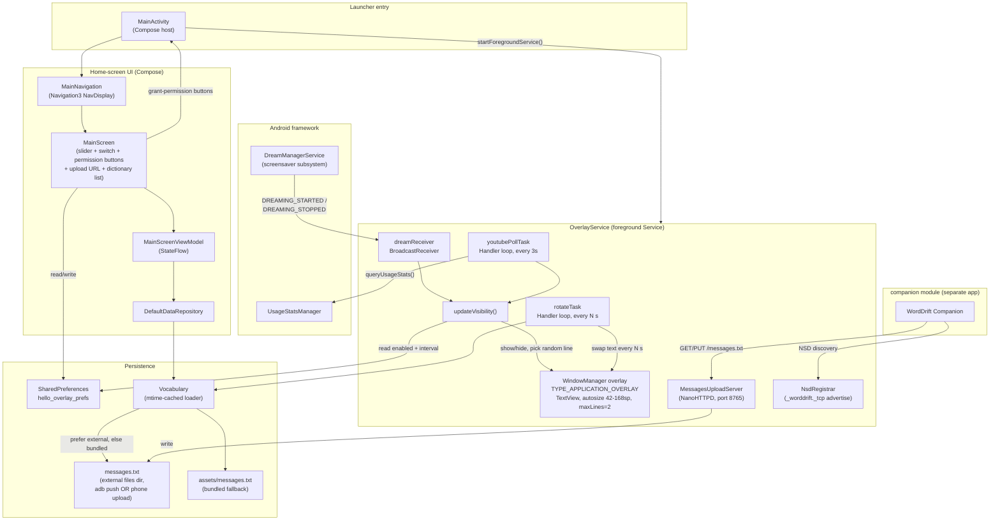
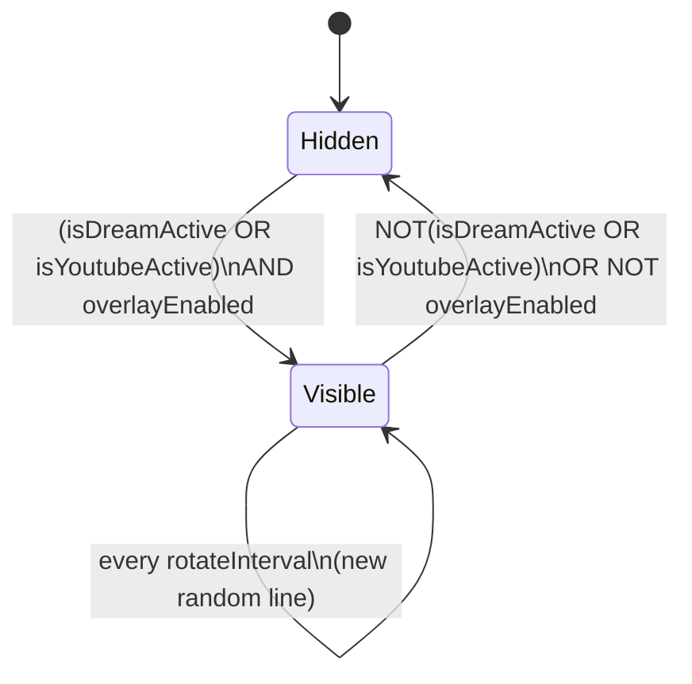

# WordDrift — Architecture

WordDrift is an Android TV app (tested on a TCL Google TV, `RTD2851M` / Android 11) that
shows a random line from a vocabulary file as a large, auto-sizing overlay whenever the
**screensaver** or **YouTube** is active, doubles as a browsable dictionary app on its own
home screen, and runs a small local-network HTTP server so a **companion phone app** (a
separate module in this repo) can edit the vocabulary remotely.

Package: `com.claudetest.hello`. Min SDK 26, target SDK 36 (compileSdk).

This repo has two Gradle modules:
- **`app`** — the TV app (everything in this document unless stated otherwise).
- **`companion`** — the Android phone app, package `com.claudetest.worddrift.companion`. See
  §7.

## 1. Component diagram



**Three independent entry points share the vocabulary file and (for the two on-TV ones) one
settings store, but otherwise don't talk to each other directly:**

- `MainActivity` → Compose UI (`MainScreen`) — the browsable dictionary + settings screen.
- `MainActivity` also starts `OverlayService`, a long-running foreground `Service` that
  owns a system-level overlay window independent of any Activity, *and* an embedded HTTP
  server for the companion app.
- The companion phone app talks to `OverlayService`'s HTTP server over the local network —
  it never touches the TV's filesystem or `SharedPreferences` directly.

## 2. Components

### MainActivity (`MainActivity.kt`)
Entry point. On `onCreate()`: `startForegroundService(OverlayService)`, then
`setContent { MainNavigation() }`.

Also tracks a `launchingSystemSettings` flag. The activity normally `finish()`es itself in
`onStop()` (a memory-saving measure — see §5) whenever it's backgrounded, but that would
also fire the instant a permission-grant button launches a system Settings screen (§2,
Compose UI), stranding the user on the home launcher instead of back in the app. The flag
is set right before `startActivity()`-ing a Settings intent and cleared again once
`onStop()` has consumed it, so only a *genuine* backgrounding triggers the early finish.

### OverlayService (`OverlayService.kt`)
A foreground `Service` (required so Android/TCL don't kill it as a background process —
see §4) that owns exactly one `TextView` added directly via `WindowManager.addView()`
with `TYPE_APPLICATION_OVERLAY`. This is *not* a normal Activity window — it floats above
whatever else is on screen, full width, anchored near the top (`gravity = TOP`, `y = 24`).

Creating that window requires `SYSTEM_ALERT_WINDOW`, which is commonly missing (fresh
install, or the user hasn't granted it yet). `ensureOverlayViewCreated()` guards every
attempt to build the view with `Settings.canDrawOverlays()` — without this the service
crashes the whole process (`BadTokenException`) the moment it's missing, taking
`MainActivity` down with it. It's called from both `onCreate()` and `onStartCommand()`, so
an already-running service picks up a permission granted after the fact (the Compose UI
nudges it by re-calling `startForegroundService()` on `ON_RESUME` once it sees the
permission newly granted) without needing a process restart.

The service also owns two other long-lived pieces used by the companion app (§7):
`MessagesUploadServer` (a NanoHTTPD instance on port 8765) and `NsdRegistrar` (advertises
that server over NSD/mDNS). Both are started right after the HTTP server binds
successfully and stopped in `onDestroy()`.

It decides overlay visibility from two independent signals, OR'd together, gated by a
master enable switch:



- **`isDreamActive`** — driven by a `BroadcastReceiver` listening for the system
  broadcasts `android.intent.action.DREAMING_STARTED` / `DREAMING_STOPPED`, sent by
  `DreamManagerService` whenever *any* Daydream/screensaver starts or stops. No
  permission required; this is the single most reliable signal in the app (see §4).
- **`isYoutubeActive`** — polled every 3s via `UsageStatsManager.queryUsageStats()`.
  YouTube (`com.google.android.youtube.tv`) is considered "active" when its
  `lastTimeUsed` is the **most recent of all packages** returned in a 60-second window —
  not merely "recent in absolute time" (see §4 for why).

`updateVisibility()` is the single place both signals converge; it also re-reads the
enable/disable switch and the rotate interval from `SharedPreferences` on every call, so
changes made in the UI take effect within one poll cycle without restarting the service.

### MessagesUploadServer (`MessagesUploadServer.kt`)
A tiny embedded HTTP server (NanoHTTPD) bound to a fixed path, `/messages.txt`:

- `GET /messages.txt` → the current dictionary (via `Vocabulary.loadLines`), so the
  companion app can fetch-then-edit instead of starting blank.
- `PUT /messages.txt` → replaces `Vocabulary.externalFile(context)` with the request body.
  Validates: non-empty `Content-Length` under 2MB, strict UTF-8 decoding (rejects
  malformed byte sequences rather than silently replacing them), and at least one
  non-blank line. Any other method/path gets 404/405.

No authentication — reachability on the same WiFi network is the same trust boundary this
app already relies on for ADB access. Since it writes to the exact file `Vocabulary`
already watches (§2, Persistence), an upload takes effect automatically on the next
rotation via the existing mtime-cache invalidation — no extra wiring needed.

### NsdRegistrar (`NsdRegistrar.kt`) / NetworkUtils (`NetworkUtils.kt`)
`NsdRegistrar` advertises the upload server via NSD (`NsdManager.registerService`) as
service type `_worddrift._tcp.`, name `"WordDrift"`, so the companion app can find the TV
without a typed-in IP. `NetworkUtils.localIpAddress()` is a permission-free
`NetworkInterface` scan used only to *display* the current IP + upload URL in the
settings screen (for manual `curl`/debugging use); it plays no part in the companion app's
own discovery, which goes through NSD independently.

### Compose UI (`ui/main/MainScreen.kt`, `MainScreenViewModel.kt`, `data/DataRepository.kt`)
- `DefaultDataRepository` reads the vocabulary (via `Vocabulary.loadLines`) as a cold
  `Flow<List<String>>` (one emission per screen open).
- `MainScreenViewModel` turns that into a `StateFlow<MainScreenUiState>` (Loading /
  Success / Error) via `stateIn`.
- `MainScreen` renders:
  - An interval slider (5–60s) and an enable/disable switch, both backed by
    `SharedPreferences`.
  - Two conditional buttons — **"Enable display over other apps"** and **"Enable usage
    access"** — each visible only while its respective permission is missing, and gone
    once granted (checked via `Settings.canDrawOverlays()` /
    `AppOpsManager.checkOpNoThrow(OPSTR_GET_USAGE_STATS, …)`, re-evaluated on every
    `ON_RESUME`). Tapping one launches the matching system Settings screen through
    `MainActivity`'s `onLaunchSystemSettings` callback (see MainActivity above for why
    that doesn't get the activity killed mid-flow).
  - A line showing the current upload URL (`http://<ip>:8765/messages.txt`) once the
    device's local IP can be determined.
  - A `LazyColumn` of the full dictionary (1000+ entries — this **must** stay lazy; an
    eager `Column` was tried first and caused a 5s ANR on this device's quad-core
    ARMv7 SoC).
- **All D-pad input is handled by one root-level `Modifier.onKeyEvent`** on the
  outermost `Column`, not by focus traversal between the individual widgets:
  - `UP` / `DOWN` → scroll the list (`LazyListState.scrollBy`)
  - `LEFT` / `RIGHT` → adjust the interval slider
  - `CENTER` / `ENTER` → **if a permission button is visible, activates the first one**
    (overlay permission takes priority over usage access); otherwise toggles the switch.

  This was a deliberate redesign — the first version relied on Compose's default
  focus-navigation (arrow keys move focus between Slider/Switch/List, then act on
  whichever is focused), which was fragile and unintuitive on a TV remote. Routing
  every key globally makes each control's behavior independent of what's "focused." The
  permission buttons are the one case where OK's meaning depends on state, since they
  only exist during first-run setup and vanish once granted.

### Persistence
- **`AppPrefs.kt`** — the single source of truth for `SharedPreferences` key names and
  defaults, shared by `MainScreen` (writer) and `OverlayService` (reader). No other
  IPC/binding between the two processes' components exists; they're decoupled entirely
  through this file-backed key-value store.
- **`Vocabulary.kt`** — the single loader used by every reader of the dictionary
  (`OverlayService`, `DefaultDataRepository`, `MessagesUploadServer`'s GET handler) and
  the single source of truth for *where* the external file lives
  (`externalFile(context)`), used by both the loader and `MessagesUploadServer`'s PUT
  handler so they can never disagree on the path.

  Prefers the external file
  (`/sdcard/Android/data/com.claudetest.hello/files/messages.txt` — updated via
  `adb push` or a companion-app upload, no rebuild needed) and falls back to
  `assets/messages.txt`, bundled in the APK, so a fresh install has vocabulary
  out-of-the-box without needing anything pushed to it.

  **Caches the parsed result.** Every rotation used to re-open and re-parse the whole
  file from scratch; now the external file's `lastModified()` (a cheap stat, not a read)
  is checked on every call, and the full read+parse only happens when that mtime has
  actually changed. An `adb push` or phone upload still takes effect on the very next
  read — the cache is invalidated, not bypassed.

## 3. Data flow: from file to screen

```mermaid
sequenceDiagram
    participant Dev as adb push / phone app
    participant HTTP as MessagesUploadServer
    participant FS as messages.txt
    participant Vocab as Vocabulary (cache)
    participant Repo as DefaultDataRepository
    participant VM as MainScreenViewModel
    participant UI as MainScreen (list)
    participant Ovl as OverlayService

    alt via adb push
        Dev->>FS: overwrite file directly
    else via companion app
        Dev->>HTTP: PUT /messages.txt
        HTTP->>FS: validate + write
    end
    Note over FS: No app restart needed either way

    UI->>Repo: collectAsStateWithLifecycle()
    Repo->>Vocab: loadLines(context)
    Ovl->>Vocab: loadLines(context) (every rotate tick)
    Vocab->>FS: stat mtime; re-read only if changed
    Vocab-->>Repo: List<String> (cached or freshly parsed)
    Repo-->>VM: Flow<List<String>>
    VM-->>UI: StateFlow<Success(data)>
    Ovl-->>Ovl: lines.random()
```

## 4. Platform constraints that shaped this design

This device (TCL Google TV, Realtek `RTD2851M`, 2 GB RAM) runs a heavily customized
Android 11 build with its own aggressive process/foreground-service governor
(`TGuardMemoryManager`, `TclAppBoot`) and a locked-down Settings app missing several stock
screens. Several "normal Android" approaches were tried and **rejected** during
development — documented here so they aren't re-attempted:

| Approach tried | Why it failed |
|---|---|
| `AccessibilityService` to detect any foreground-app change | Binding silently refused by the platform even after full manual user consent via Settings; no error, just never binds. |
| `UsageStatsManager.queryEvents()` for `MOVE_TO_FOREGROUND`/`ACTIVITY_RESUMED` | Consistently returns **zero** such events for any package, including the caller's own — appears to be deliberately filtered on this OEM build. Other event types (background, foreground-service start/stop) came through fine. |
| `lastTimeUsed` as a "recency" check (`lastTimeUsed >= now - threshold`) | `lastTimeUsed` is a **discrete timestamp set once per foreground transition**, not a continuously-ticking heartbeat — it can sit frozen for 90+ seconds while the app is genuinely still in the foreground. Fixed by comparing it against the *max* `lastTimeUsed` across all packages instead of against "now". |
| `AudioManager.AudioPlaybackCallback` for "YouTube is active" | Works, but fires for *any* app with active audio/video playback (Netflix, Megogo, ...), not specifically YouTube — dropped per explicit product requirement. |
| Plain `startService()` / always-visible overlay | `TGuardMemoryManager` kills non-foreground services under memory pressure; `OverlayService` must call `startForeground()`. Even so, `TclAppBoot` has been observed to block `startForeground()` itself ("`default_borbid`") when the calling app loses foreground focus at the exact moment the service starts — a real, occasionally-reproducible race with no known full fix short of root. |
| Eager `Column` for the 1000+-line dictionary | Composes/measures every row up front regardless of visibility → ANR (`Input dispatching timed out`) on this SoC. Fixed by switching to `LazyColumn`. |
| `android.settings.USAGE_ACCESS_SETTINGS` intent | Doesn't resolve on this firmware at all (`ActivityNotFoundException`) — this Settings screen appears to be stripped from the build entirely, not just hard to reach. `MANAGE_OVERLAY_PERMISSION` *does* resolve, which is why only usage access is a permanent ADB-only permission on this device (§5). |
| Re-enabling a TCL-disabled system package (`pm enable`) | Unrelated to this app's own permissions, but documented from the same investigation: TCL's "remove persistency" service-menu option disables system packages (e.g. `com.google.android.tungsten.setupwraith`) at a level even `adb shell pm enable` is rejected for (`SecurityException: Shell cannot change component state`). No fix short of root. |

## 5. Manifest permissions

| Permission | Used for |
|---|---|
| `SYSTEM_ALERT_WINDOW` | Draw the `TYPE_APPLICATION_OVERLAY` window. Grantable in-app via the "Enable display over other apps" button (launches `MANAGE_OVERLAY_PERMISSION`, which *does* resolve on this device) — no ADB required on most devices. Falls back to `adb shell appops set … SYSTEM_ALERT_WINDOW allow` if that screen doesn't exist on a given TV. |
| `PACKAGE_USAGE_STATS` | YouTube-active detection. The "Enable usage access" button attempts `USAGE_ACCESS_SETTINGS`, but on this specific TCL firmware that screen doesn't exist (§4) — `adb shell appops set … GET_USAGE_STATS allow` is the only way on devices like this one. The button still appears and still works on TVs that do ship the screen. |
| `FOREGROUND_SERVICE`, `FOREGROUND_SERVICE_SPECIAL_USE` | Required for `OverlayService` to call `startForeground()` (Android 14+ foreground-service-type rules; declared for forward-compat even though this device is API 30). |
| `POST_NOTIFICATIONS` | The low-priority "WordDrift active" notification `startForeground()` requires a `Notification` for. |
| `INTERNET` | `MessagesUploadServer`'s socket (required for any socket use, including a purely local server). |
| `ACCESS_NETWORK_STATE`, `ACCESS_WIFI_STATE` | `NsdRegistrar`/NSD reliability on some OEM Wi-Fi stacks; `NetworkUtils`' IP lookup needs neither in practice but they're cheap, non-dangerous permissions kept for robustness. |

Neither permission grant survives an uninstall.

## 6. Package layout

```
app/src/main/java/com/claudetest/hello/
├── MainActivity.kt           — launcher entry, starts OverlayService + Compose UI,
│                                tracks launchingSystemSettings (see §2)
├── Navigation.kt              — single-destination Navigation3 host
├── NavigationKeys.kt          — nav route key(s)
├── OverlayService.kt          — the overlay + embedded HTTP server + NSD (see §2)
├── MessagesUploadServer.kt    — GET/PUT /messages.txt (NanoHTTPD)
├── NsdRegistrar.kt            — advertises the upload server via NSD
├── NetworkUtils.kt            — local IP lookup, for display only
├── Vocabulary.kt              — cached dictionary loader, single source of truth
│                                for the external file's path
├── AppPrefs.kt                — SharedPreferences keys/defaults, shared by UI + Service
├── data/
│   └── DataRepository.kt      — Vocabulary.loadLines() → Flow<List<String>>
├── ui/main/
│   ├── MainScreen.kt          — dictionary list, settings, permission buttons, upload URL
│   └── MainScreenViewModel.kt
└── theme/                     — Compose Material3 theme (Color.kt, Theme.kt, Type.kt)

app/src/main/assets/
└── messages.txt               — bundled fallback dictionary (fresh-install default)
```

## 7. Companion app (`companion` module)

A separate Android **phone** app, package `com.claudetest.worddrift.companion`, built to
let you edit the vocabulary without ADB. It has no dependency on the TV app's code — the
two only interact over HTTP/NSD on the local network, per the contract in §2
(`MessagesUploadServer`/`NsdRegistrar`).

```
companion/src/main/java/com/claudetest/worddrift/companion/
├── MainActivity.kt      — Compose UI: discovery/fetch/edit/save state machine
├── TvDiscovery.kt        — NSD client: finds the TV's _worddrift._tcp service
└── TvApiClient.kt        — plain HttpURLConnection GET/PUT of /messages.txt
```

Flow: on launch, `TvDiscovery` starts NSD discovery; the first resolved match stops
discovery and triggers a `GET`. The fetched text becomes an editable
`BasicTextField`-backed dictionary view (Material3's `OutlinedTextField` doesn't expose
`onTextLayout` on the `TextFieldValue` overload used here, which the search feature below
needs — hence the lower-level `BasicTextField`, styled to look the same). A "New word"
field live-searches the loaded text for a case-insensitive substring match and highlights
the whole matching line; finding one explicitly scrolls it to the top of the visible area
(not just "into view" — the app calls `enableEdgeToEdge()`, which makes the manifest's
`adjustResize` a no-op, so content needs `Modifier.imePadding()` to avoid drawing behind
the keyboard, and the default minimal-scroll-into-view behavior would otherwise leave a
match sitting just barely, or not, above it). An "Add" button appends the typed text as a
new line. "Save to TV" `PUT`s the (possibly edited) text back to the same host/port
discovery resolved.

The manifest sets `android:usesCleartextTraffic="true"` — deliberate, since the app's
entire purpose is local-network plain HTTP to the TV; Android blocks cleartext by default
on modern `targetSdk`.
