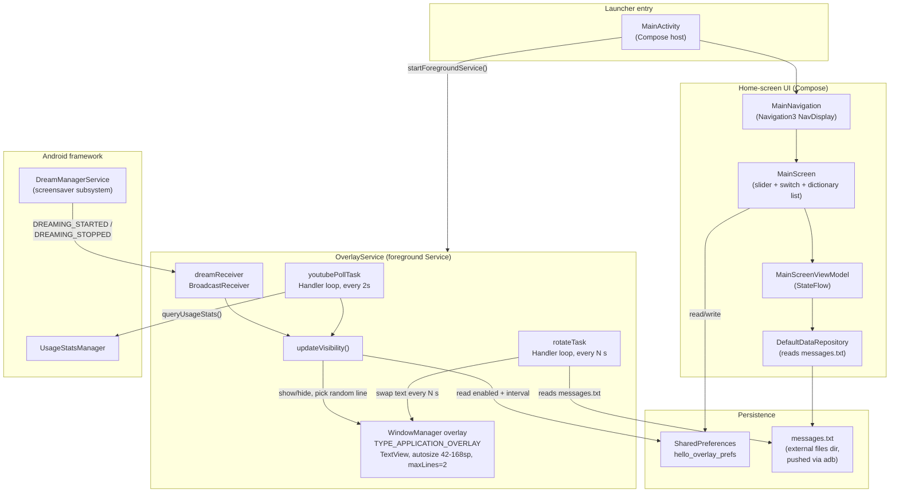
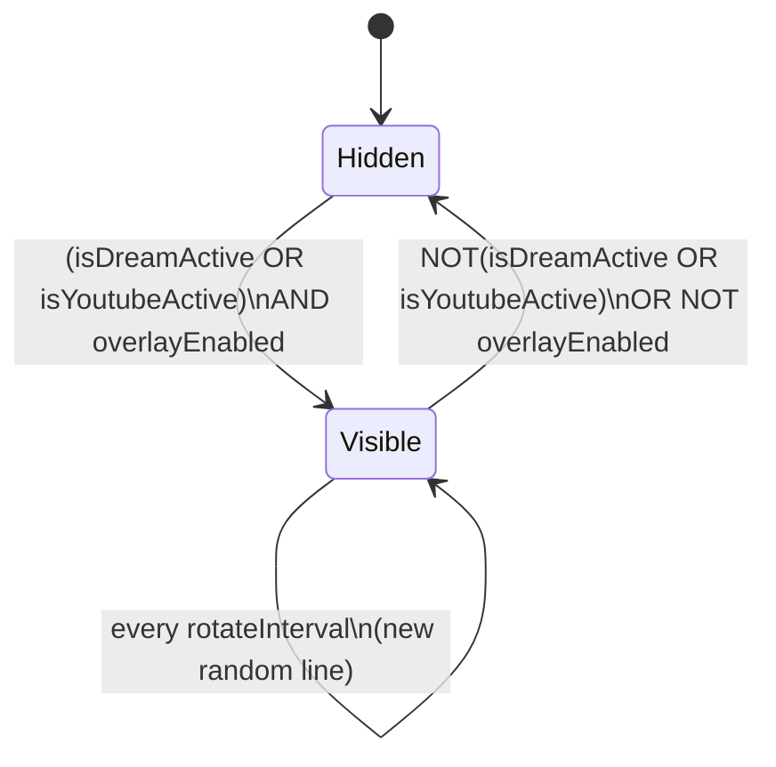
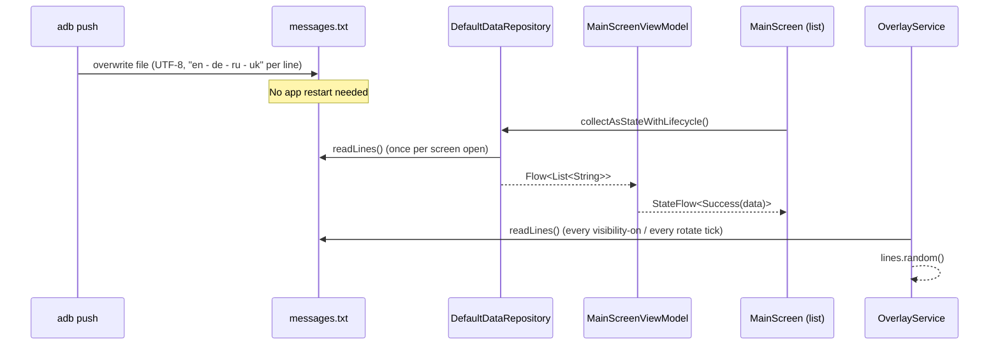

# WordDrift — Architecture

WordDrift is an Android TV app (tested on a TCL Google TV, `RTD2851M` / Android 11) that
shows a random line from a vocabulary file as a large, auto-sizing overlay whenever the
**screensaver** or **YouTube** is active, and doubles as a browsable dictionary app on its
own home screen.

Package: `com.claudetest.hello`. Min SDK 26, target SDK 36 (compileSdk).

## 1. Component diagram



**Two independent Compose entry points share one data file (`messages.txt`) and one
settings store (`SharedPreferences`), but otherwise don't talk to each other directly:**

- `MainActivity` → Compose UI (`MainScreen`) — the browsable dictionary + settings screen.
- `MainActivity` also starts `OverlayService`, a long-running foreground `Service` that
  owns a system-level overlay window independent of any Activity.

## 2. Components

### MainActivity (`MainActivity.kt`)
Entry point. On `onCreate()` it does two unrelated things:
1. `startForegroundService(OverlayService)` — get the overlay running.
2. `setContent { MainNavigation() }` — render the Compose dictionary/settings screen.

### OverlayService (`OverlayService.kt`)
A foreground `Service` (required so Android/TCL don't kill it as a background process —
see §4) that owns exactly one `TextView` added directly via `WindowManager.addView()`
with `TYPE_APPLICATION_OVERLAY`. This is *not* a normal Activity window — it floats above
whatever else is on screen, full width, anchored near the top (`gravity = TOP`, `y = 24`).

It decides visibility from two independent signals, OR'd together, gated by a master
enable switch:



- **`isDreamActive`** — driven by a `BroadcastReceiver` listening for the system
  broadcasts `android.intent.action.DREAMING_STARTED` / `DREAMING_STOPPED`, sent by
  `DreamManagerService` whenever *any* Daydream/screensaver starts or stops. No
  permission required; this is the single most reliable signal in the app (see §4).
- **`isYoutubeActive`** — polled every 2s via `UsageStatsManager.queryUsageStats()`.
  YouTube (`com.google.android.youtube.tv`) is considered "active" when its
  `lastTimeUsed` is the **most recent of all packages** returned in a 5-minute window —
  not merely "recent in absolute time" (see §4 for why).

`updateVisibility()` is the single place both signals converge; it also re-reads the
enable/disable switch and the rotate interval from `SharedPreferences` on every call, so
changes made in the UI take effect within one poll cycle (≤2s) without restarting the
service.

### Compose UI (`ui/main/MainScreen.kt`, `MainScreenViewModel.kt`, `data/DataRepository.kt`)
- `DefaultDataRepository` reads `messages.txt` as a cold `Flow<List<String>>` (one emission).
- `MainScreenViewModel` turns that into a `StateFlow<MainScreenUiState>` (Loading /
  Success / Error) via `stateIn`.
- `MainScreen` renders:
  - An interval slider (5–60s) and an enable/disable switch, both backed by
    `SharedPreferences`.
  - A `LazyColumn` of the full dictionary (1000+ entries — this **must** stay lazy; an
    eager `Column` was tried first and caused a 5s ANR on this device's quad-core
    ARMv7 SoC).
- **All D-pad input is handled by one root-level `Modifier.onKeyEvent`** on the
  outermost `Column`, not by focus traversal between the individual widgets:
  - `UP` / `DOWN` → scroll the list (`LazyListState.scrollBy`)
  - `LEFT` / `RIGHT` → adjust the interval slider
  - `CENTER` / `ENTER` → toggle the switch

  This was a deliberate redesign — the first version relied on Compose's default
  focus-navigation (arrow keys move focus between Slider/Switch/List, then act on
  whichever is focused), which was fragile and unintuitive on a TV remote. Routing
  every key globally makes each control's behavior independent of what's "focused."

### Persistence
- **`AppPrefs.kt`** — the single source of truth for `SharedPreferences` key names and
  defaults, shared by `MainScreen` (writer) and `OverlayService` (reader). No other
  IPC/binding between the two processes' components exists; they're decoupled entirely
  through this file-backed key-value store.
- **`messages.txt`** — lives in the app's external files dir
  (`/sdcard/Android/data/com.claudetest.hello/files/messages.txt`), *not* bundled as an
  APK asset. This is intentional: the vocabulary list is updated by pushing a new file
  over `adb push` without rebuilding or reinstalling the app. Both the overlay and the
  dictionary screen read it independently, each picking their own random line /
  full listing.

## 3. Data flow: from file to screen



## 4. Platform constraints that shaped this design

This device (TCL Google TV, Realtek `RTD2851M`, 2 GB RAM) runs a heavily customized
Android 11 build with its own aggressive process/foreground-service governor
(`TGuardMemoryManager`, `TclAppBoot`). Several "normal Android" approaches were tried and
**rejected** during development — documented here so they aren't re-attempted:

| Approach tried | Why it failed |
|---|---|
| `AccessibilityService` to detect any foreground-app change | Binding silently refused by the platform even after full manual user consent via Settings; no error, just never binds. |
| `UsageStatsManager.queryEvents()` for `MOVE_TO_FOREGROUND`/`ACTIVITY_RESUMED` | Consistently returns **zero** such events for any package, including the caller's own — appears to be deliberately filtered on this OEM build. Other event types (background, foreground-service start/stop) came through fine. |
| `lastTimeUsed` as a "recency" check (`lastTimeUsed >= now - threshold`) | `lastTimeUsed` is a **discrete timestamp set once per foreground transition**, not a continuously-ticking heartbeat — it can sit frozen for 90+ seconds while the app is genuinely still in the foreground. Fixed by comparing it against the *max* `lastTimeUsed` across all packages instead of against "now". |
| `AudioManager.AudioPlaybackCallback` for "YouTube is active" | Works, but fires for *any* app with active audio/video playback (Netflix, Megogo, ...), not specifically YouTube — dropped per explicit product requirement. |
| Plain `startService()` / always-visible overlay | `TGuardMemoryManager` kills non-foreground services under memory pressure; `OverlayService` must call `startForeground()`. Even so, `TclAppBoot` has been observed to block `startForeground()` itself ("`default_borbid`") when the calling app loses foreground focus at the exact moment the service starts — a real, occasionally-reproducible race with no known full fix short of root. |
| Eager `Column` for the 1000+-line dictionary | Composes/measures every row up front regardless of visibility → ANR (`Input dispatching timed out`) on this SoC. Fixed by switching to `LazyColumn`. |

## 5. Manifest permissions

| Permission | Used for |
|---|---|
| `SYSTEM_ALERT_WINDOW` | Draw the `TYPE_APPLICATION_OVERLAY` window. Granted via `adb shell appops set … SYSTEM_ALERT_WINDOW allow` (no Settings UI flow exists on this launcher). |
| `PACKAGE_USAGE_STATS` | YouTube-active detection. Granted via `adb shell appops set … GET_USAGE_STATS allow`. |
| `FOREGROUND_SERVICE`, `FOREGROUND_SERVICE_SPECIAL_USE` | Required for `OverlayService` to call `startForeground()` (Android 14+ foreground-service-type rules; declared for forward-compat even though this device is API 30). |
| `POST_NOTIFICATIONS` | The low-priority "WordDrift active" notification `startForeground()` requires a `Notification` for. |

Neither `SYSTEM_ALERT_WINDOW` nor `PACKAGE_USAGE_STATS` can be granted through this
launcher's Settings UI — both are set via `adb shell appops set` after every install and
do not survive an uninstall.

## 6. Package layout

```
com.claudetest.hello/
├── MainActivity.kt          — launcher entry, starts OverlayService + Compose UI
├── Navigation.kt            — single-destination Navigation3 host
├── NavigationKeys.kt        — nav route key(s)
├── OverlayService.kt        — the overlay itself (see §2)
├── AppPrefs.kt               — SharedPreferences keys/defaults, shared by UI + Service
├── data/
│   └── DataRepository.kt    — reads messages.txt → Flow<List<String>>
├── ui/main/
│   ├── MainScreen.kt        — dictionary list + interval slider + enable switch
│   └── MainScreenViewModel.kt
└── theme/                   — Compose Material3 theme (Color.kt, Theme.kt, Type.kt)
```
